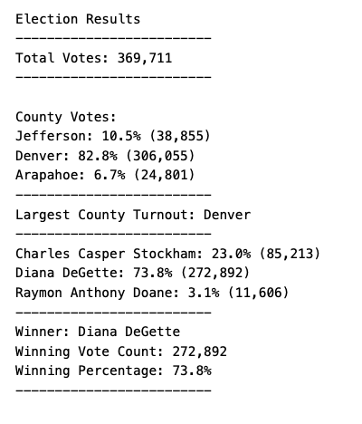

# Election-analysis

## Overview of Election Audit

In this project we performed analysis on election result data for the state of Colorado to help Tom find the winner of the local congressional election along with the voter turnout for each county, the percentage of votes from each county out of the total count, and the county with the highest turnout.

## Election-Audit Results

Results of the election audit shows that:

- Total votes cast are **369,711**.
- List of Candidates with votes:
  - Charles Casper Stockham got 23.0% of the vote and 85,213 number of votes.
  - Diana DeGette got 73.8% of the vote and 272,892 number of votes.
  - Raymon Anthony Doane got 3.1% of the vote and 11,606 number of votes.
- Winner of the election is: **Diana DeGette** with 73.8% (272,892)of the votes.
- The county results are:

  - Jefferson county accounted for 10.5% of the vote and 38,855 number of votes.
  - Denver county accounted for 82.8% of the vote and 306,055 number of votes.
  - Arapahoe county accounted for 6.7% of the vote and 24,801 number of votes.

- County with largest voter turnout is **Denver**.

## Election-Audit Summary

This script can be used with some modifications for any election. By replacing the data and file we can use this script for other elections also. We can then modify variables according to the new dataset.
